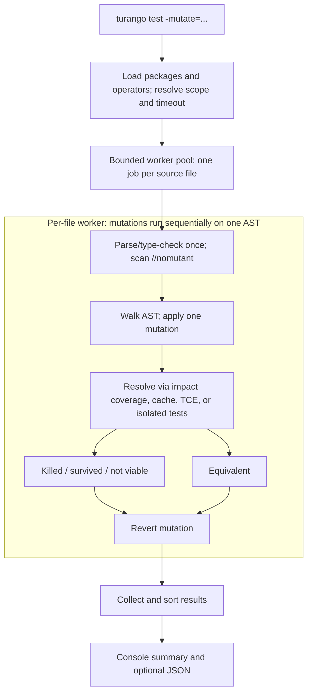

# turango


*Mascot derived from the Go gopher, designed by [Renee French](https://go.dev/blog/gopher), licensed under [Creative Commons Attribution 4.0](https://creativecommons.org/licenses/by/4.0/).*

[](https://pkg.go.dev/github.com/jh125486/turango)

[](https://github.com/jh125486/turango/actions/workflows/ci.yml)
[](https://github.com/jh125486/turango/actions/workflows/codeql-analysis.yml)
[](https://github.com/jh125486/turango/actions/workflows/mutation-badge.yml)
[](https://github.com/jh125486/turango/actions/workflows/mutation-badge.yml)
[](https://github.com/jh125486/turango/actions/workflows/corpus.yml)

[](https://codecov.io/gh/jh125486/turango)
[](https://sonarcloud.io/summary/overall?id=jh125486_turango)

[](https://www.codefactor.io/repository/github/jh125486/turango)
[](https://scorecard.dev/viewer/?uri=github.com/jh125486/turango)

[](https://sonarcloud.io/summary/new_code?id=jh125486_turango)
[](https://sonarcloud.io/summary/new_code?id=jh125486_turango)
[](https://sonarcloud.io/summary/new_code?id=jh125486_turango)
[](https://sonarcloud.io/summary/new_code?id=jh125486_turango)
[](https://sonarcloud.io/summary/new_code?id=jh125486_turango)
[](https://sonarcloud.io/summary/new_code?id=jh125486_turango)
[](https://sonarcloud.io/summary/new_code?id=jh125486_turango)

Mutation testing for `go test`, added the same way fuzzing was: not a
separate tool bolted onto the ecosystem, but a `go`-compatible drop-in that
adds one new test mode.

`turango` is a transparent shim binary. `turango test -mutate=. ./...` runs
the mutation engine; every other invocation (`turango build ./...`,
`turango vet ./...`, plain `turango test ./...`, ...) is forwarded verbatim
to the real Go toolchain, unchanged.

Mutation testing evaluates test-suite fault-detection effectiveness, not just
whether code was executed. It mechanically introduces small, reversible
changes ("mutants") into a
package's AST — flip `+` to `-`, flip `<` to `<=`, delete a statement, empty
an `if` body — and reruns selected tests against each one. A mutant is
"killed" when that run fails or times out and "survives" when those tests
pass. Both verdicts are evidence to interpret, not proof by themselves: a
kill can be incidental, while a survivor can be a test gap, uncovered code,
or a behaviorally-equivalent change.

See [`PROPOSAL.md`](PROPOSAL.md) for the full case for why this belongs in
`go test` itself, including evidence gathered by running turango against
real `crypto/...` stdlib packages.

## Mutation testing in software engineering

Mutation testing tests the tests. Structural coverage answers whether a
line or branch ran; mutation testing asks whether changing its behavior
would make the suite fail. That makes a surviving mutant a concrete review
target: either an assertion, input, or test boundary is missing, or the
change is behaviorally irrelevant. Empirical work has found that mutant
detection correlates with detection of real faults independently of code
coverage, while large-scale industrial research found that developers use
survivors to add useful tests and that mutants can be coupled to historical
production faults. Mutation testing is still a proxy for fault detection,
not proof that the program is correct.

### How it works

1. Run the original test suite. Mutation results are meaningless unless the
   baseline is green and repeatable.
2. Generate many program variants, usually with one small syntactic change
   each: reverse a comparison, alter a boundary, replace an operator, remove
   a statement, or change a literal.
3. Build and test each variant in isolation. A failing test or timeout
   **kills** the mutant; an all-green run means it **survived**; a variant
   that cannot compile is **not viable**.
4. Inspect survivors, then add a contract-level test, fix an incorrect
   requirement or implementation, or document why the mutation should be
   excluded.

Turango reports its score as `killed / (killed + survived)`. Not-viable,
suppressed, and TCE-filtered equivalent mutants are outside the ratio. That
accounting detail matters: tools with different operators, filters, scopes,
or denominator rules do not produce directly comparable scores.

### What the score does—and does not—say

- A killed mutant shows that the selected test run fails or times out for
  that change. It does not show that an assertion checks the right
  requirement; incidental or overly coupled assertions can kill mutants too.
- A survivor is evidence to investigate, not automatically a missing test.
  It may expose a genuine test gap, an **equivalent mutant** whose observable
  behavior is unchanged, or behavior the team intentionally does not test
  (for example, unimportant logging).
- A high score gives confidence only over the code, operators, and test
  scope actually exercised. It says nothing about faults the selected
  mutation model cannot represent, omitted packages, missing end-to-end
  behavior, or a wrong specification shared by code and tests.
- The useful unit is usually a survivor and its source diff, not a
  repository-wide percentage. Prefer improving important behavior over
  chasing an arbitrary 100% target.

### Common gotchas

- **Equivalent mutants:** determining semantic equivalence is not generally
  automatable. Treat compiler-based filtering as a useful partial technique,
  review suspicious survivors, and document suppressions instead of weakening
  the threshold silently.
- **Runtime cost:** mutant count multiplied by test-suite time is only a
  first-order estimate; workspace creation, compilation, and tool overhead
  add cost. Test selection, narrower scopes, parallel workers, caching,
  incremental runs, and selective operators reduce cost, but scope reduction
  can miss tests in callers or integration packages.
- **Flaky or stateful tests:** timing sensitivity, test-order dependencies,
  shared external state, and nondeterminism can turn mutants into false kills
  or inconsistent survivors. Stabilize and repeat the baseline first.
- **Test overfitting:** do not mirror implementation details merely to kill a
  mutant. Assert externally meaningful contracts and boundary behavior; if
  two implementations are equivalent under the contract, suppress the mutant
  with a reason.
- **Metric gaming:** generated code, defensive code, trivial accessors, and
  low-value side effects can dominate a report. Exclude them deliberately and
  visibly. A higher score caused only by changing the operator set or
  denominator is not a stronger suite.
- **CI adoption:** start on changed or high-risk packages, triage survivors,
  and record a baseline. Ratchet against regressions rather than imposing a
  universal threshold on day one; run broader mutation sweeps periodically to
  catch cross-package gaps hidden by fast local scopes.

Research and practitioner references:

- Jia and Harman, [*An Analysis and Survey of the Development of Mutation
  Testing*](https://doi.org/10.1109/TSE.2010.62) (2011).
- Papadakis et al., [*Mutation Testing Advances: An Analysis and
  Survey*](https://discovery.ucl.ac.uk/id/eprint/10056704/) (2019).
- Just et al., [*Are Mutants a Valid Substitute for Real Faults in Software
  Testing?*](https://doi.org/10.1145/2635868.2635929) (2014).
- Petrovic et al., [*Long Term Effects of Mutation
  Testing*](https://research.google/pubs/long-term-effects-of-mutation-testing/)
  (2021).
- PIT, [*Basic concepts*](https://pitest.org/quickstart/basic_concepts/), for a
  practical description of test selection and equivalent mutations.

## Install / build

Turango requires Go 1.26 or newer.

```
go build ./cmd/turango
```

That produces a `turango` binary you run instead of `go`. There's no alias
step required for normal use — see the note on alias mode below.

## Usage

```
turango test -mutate=. ./...
```

`-mutate` works like `-run`/`-bench`/`-fuzz`: its value is a regular
expression matched against function/method names, not a package selector.
`-mutate=.` matches every function (mirroring `-bench=.`'s "run every
benchmark" convention); package selection is the ordinary trailing
argument(s), exactly as with those three flags. Package-level declarations
are not inside a function, so they remain eligible regardless of the
function-name regexp.

Everything that isn't `test` with a `-mutate=` flag goes straight to the
real `go` command:

```
turango build ./...     # identical to `go build ./...`
turango test ./...      # identical to `go test ./...` — no mutation, -mutate not set
```

### Flags (mutation mode only)

All of turango's own flags require the `-flag=value` form (a bare
`-flag value` is rejected as ambiguous). They're only recognized following
`test`.

| Flag | Default | Meaning |
| --- | --- | --- |
| `-mutate=<regexp>` | — | Required to enter mutation mode. A regular expression matched against function/method names in the target packages — behaves like `-run`/`-bench`/`-fuzz`, not a package selector. `-mutate=.` matches every function (mirroring `-bench=.`). Package selection is the ordinary trailing argument(s) after `test`, exactly as with those three flags, e.g. `turango test -mutate=. ./...`. |
| `-mutatescope=full\|package\|impact` | `full` | How much of the test suite reruns per mutant. `full` reruns `go test ./...` for the whole module (catches mutants killed by a neighboring package's tests); `package` reruns only the mutated file's own package (much cheaper, recommended when mutating a package that lives inside a slow module — see `example/README.md`); `impact` builds a per-test coverage map once and reruns only the tests that actually cover the mutated line. |
| `-mutateoperators=<comma-list>` | all registered operators | Restrict which mutation operators run (see the operator list below for names). |
| `-mutateparallel=<n>` | `GOMAXPROCS` | Worker-pool size. Parallelizes at the file level, since one file's AST is mutated in place across its own mutants. |
| `-mutatetimeout=<duration>` | baseline-derived | Per-mutant budget. If unset, turango times the real suite three times, averages, and scales by CPU count, so a mutant that produces an infinite loop (e.g. `i++` flipped to `i--`) doesn't stall the run to `go test`'s own ~10-minute default. A timeout counts as a kill. |
| `-mutateoutput=<dir>` | none | Write a JSON report (`mutate-report.json`) into this directory. |
| `-mutatemin=<float>` | none | Exit with status 3 if the resulting mutation score falls below this threshold — for CI gating. Scores themselves range from 0 to 1. |
| `-mutatemutant=<id>` | none | Replay exactly one mutant by the ID printed for it (in the console survivor listing or a JSON report's `MutantResult.ID`). The engine still walks every file and node — that part is cheap — but only the matching mutation is ever run, so the result holds at most one mutant. |
| `-mutatetce=true\|false` | `false` | Trivial Compiler Equivalence: filter a mutant whose compiled output exactly matches a per-package baseline before it ever reaches the test suite, reporting it separately (see below) instead of as an ordinary survivor. Off by default — see "Filtering equivalent mutants" below for why. |
| `-mutateworkspace=copy\|worktree` | `copy` | How a mutant's throwaway workspace is built when turango needs the full module. `copy` recursively copies it (works everywhere, no git dependency). `worktree` uses `git worktree add`, sharing the repository's object store. Under `package`/`impact`, a safe dependency-closure copy takes precedence over either setting. `worktree` is opt-in and falls back to `copy` when the target is not inside a clean git working tree. |
| `-mutateestimate=true\|false` | `false` | Preview a run instead of executing it: walk every file/node to count how many mutants would be generated, per package, then time one baseline sample per package (whole-module under `-mutatescope=full`, per-package otherwise) to extrapolate a rough serial and `-mutateparallel`-divided time estimate — both explicitly hedged, since real speedup is sub-linear under contention. No mutation is ever applied to disk and no mutant's `go test` is ever spawned to classify it. Incompatible with `-mutateoutput`/`-mutatemin`, which are rejected at parse time (nothing was classified, so there's no report to write or score to gate on). |
| `-mutatecache=<dir>` | none | Persist executed and TCE-classified verdicts to a JSON-Lines file (`mutate-cache.jsonl`) inside this directory, and reuse them on later runs against unchanged source. Uncovered `impact` survivors are recomputed without running tests. Keys contain more than the mutant ID (a same-position, same-width literal/identifier edit can otherwise collide) — see "Resuming after interruption" below. Incompatible with `-mutateestimate`; compatible with `-mutatemutant` (replay bypasses cache reads but writes its result). |

### Suppressing a mutant: `//nomutant`

A `//nomutant` (or `//nomutant: reason`) comment above a statement excludes
it from mutation. On a compound statement (`if`/`for`/`switch`) the
suppression cascades into its body. See `example/README.md` for a worked
example, including how it affects the reported score.

### Exit codes

- `0` success
- `1` failure/error
- `2` bad usage
- `3` mutation score below `-mutatemin`

## Flag deep dives

### Scope trade-offs: `-mutatescope`

`full` (the default) reruns `go test ./...` for the whole module against
every mutant — the only scope that can't miss a kill, since a package's
behavior is frequently only asserted on by its *callers'* tests, which live
in other packages entirely. `package` and `impact` are real speed/coverage
trade-offs against that: `package` reruns only the mutated file's own
package, missing a kill from a neighboring package's integration-style test;
`impact` goes further, building a per-test coverage map once and rerunning
only the tests that actually cover the mutated line, so a mutant on an
uncovered line is reported as a survivor without a test run at all. Neither
narrower scope is a strictly-safe default — that's why `full` stays the
default rather than the fastest option winning by default, the same
reasoning `go test` itself applies by never skipping a package's tests
based on a coverage guess.

Each mutant requiring execution needs its own throwaway workspace, and how
much gets copied is scope-dependent for a hard reason, not just a performance
tuning knob: under `package`/`impact` scope, turango
resolves the mutated package's forward import closure (via
`golang.org/x/tools/go/packages`) and copies its ordinary source files,
same-module dependencies, and `go.mod`/`go.sum`. Cases that cannot be copied
safely as a closure — including vendoring, `//go:embed` assets, and local
replacement modules — fall back to a full-module workspace. Under `full`
scope the closure optimization is wrong to apply: `full`'s reason depends on the
*reverse* closure (every package that could call into the target), which a
forward-closure copy says nothing about — a workspace built that way, run
under `go test ./...`, would silently only contain (and therefore only run)
the target package's own tests, indistinguishable in outcome from
`package` scope but still labeled `full`. So `full` always uses a full-module
workspace — recursive copy or requested worktree — with no closure
computation attempted. This is a correctness boundary, not a missed
optimization.

### Filtering equivalent mutants: `-mutatetce`

TCE (Trivial Compiler Equivalence) is a named, published technique, not a
turango invention — see [`PROPOSAL.md`'s "Related work"](PROPOSAL.md#related-work)
for the real academic citation (and one for mutant subsumption, a related
technique turango deliberately doesn't implement).

Some mutations are real, syntactically-different edits that nonetheless
compile to *identical* code — a classic equivalent mutant (`i*1` vs `i`, or
deleting a dead store nothing downstream reads). A `Survived` verdict on one
of these is noise: the suite didn't miss a real behavioral gap, because
there was no behavioral difference to notice.

`-mutatetce=true` catches this class specifically: it builds one normalized
`go build -gcflags=-S` assembly baseline per unmutated package, then compares
each mutant's normalized assembly against that baseline. A match
means the mutant never reaches `go test` at all; it's reported under the
JSON report's `Equivalents` array (and a summary `equivalent: N` line) rather
than as a `MutantResult`. Comparing normalized `-S` disassembly rather than
raw compiled archive bytes was a deliberate choice, not the first thing
tried — a spike comparing raw archives directly found it unreliable,
tripping on build-metadata differences (embedded paths, timestamps) that
have nothing to do with whether the mutant actually changed behavior.

Off by default. Unlike `-mutatescope`, where a conservative choice only
under-reports kills, a false positive here would silently discard a real
mutant — so this stays opt-in until it has more real-world runs behind it.
It's also not a free optimization even when correct: the compile-and-compare
check runs for *every* mutant, not just the ones that turn out equivalent
(there's no way to know in advance which ones will), so its cost is a
per-mutant tax on 100% of mutants in exchange for skipping `go test` on
whatever fraction actually is equivalent. Measured directly against a real
stdlib fixture, that fraction needed to be higher than it was to pay for
itself — TCE was ~66% *slower* overall for that run, because the tax on
every mutant outweighed the savings on the ~2% it filtered. The general
lesson generalizes past TCE specifically: turango's knobs
(`-mutatescope`, `-mutateparallel`, `-mutatetce`) are levers whose correct
setting depends on the target codebase's own shape, not a single
universally-right configuration — measure before enabling one against a
different codebase.

### Building each mutant's workspace: `-mutateworkspace`

Every mutant requiring execution runs against its own throwaway workspace —
the mutated file has to sit somewhere outside the real source tree, with
enough of the module graph to resolve imports (sibling packages, `replace`
directives, `vendor/`, `//go:embed` assets). Cache hits and uncovered
`impact`-scope survivors do not need one. Under narrow scopes turango first
tries a dependency-closure copy; unsafe cases fall back to a full workspace.
By default (`copy`) that fallback is a recursive filesystem copy.
`-mutateworkspace=worktree` instead uses `git worktree add`: a worktree shares
the repository's object store rather than duplicating files, so it can be
cheaper on a large git repo.

It's opt-in, not a smarter default, because it has a real precondition a
filesystem copy doesn't: `git worktree add` checks out `HEAD`, the last
*commit*, never the on-disk working copy. Requesting `worktree` against a
target with any uncommitted change anywhere in the repository (not just
under the mutated package) — or against a target that isn't a git
repository at all — falls back to `copy` on its own, silently and safely,
so it's never wrong to ask for it; it just doesn't always help.

### Resuming after interruption: `-mutatecache`

A real mutation sweep is expensive — hours, for a large module — and until
now turango had no way to pick back up after a kill (`SIGKILL`, an OOM
reaper, a killed CI job) or even a graceful Ctrl+C: relaunching re-ran every
mutant from scratch, including the ones that had already finished.

`-mutatecache=<dir>` writes each executed or TCE-classified verdict to
`<dir>/mutate-cache.jsonl` as soon as it is produced, then consults that file
before spawning a mutant's `go test` on a later run. Re-running the same
command against unchanged source resumes quickly. Uncovered `impact`-scope
survivors are not cached because recomputing them does not run tests.

The cache key is deliberately more than a mutant's ID. A mutant ID hashes a
*position* — file, line, column, operator, mutation index — not the node's
own bytes, so a same-width edit at the same position (`x + 5` → `x + 7`,
same column) produces an identical ID for genuinely different code. Keying
on ID alone would risk serving the first edit's verdict for the second.
Instead, the key also folds in a content fingerprint for its workspace scope
(the whole module under `-mutatescope=full`; the dependency closure when that
optimization is safe), plus `-mutatescope`, `-mutatetce`, and a toolchain
identifier (`go version` + `GOOS`/`GOARCH`). An edit invalidates all entries
covered by that fingerprint, which can conservatively mean every cached
mutant under `full` scope.

Safe to delete at any time — an empty or missing cache is just a first run,
the same way `$GOCACHE` behaves. Keep cache directories scoped to one build
environment: timeout, build tags, CGO settings, and most other `go env` values
are not part of the key, so changing them can reuse a stale verdict (including
a timeout classified as a kill).

### Before/after source in the JSON report

Every `MutantResult` in `-mutateoutput`'s JSON report carries `Before`/
`After`: the mutated node's printed source text, immediately before and
after the mutation — the actual diff `Description` only summarises (e.g.
`Description: "< -> >="`, `Before: "v < lo"`, `After: "v >= lo"`), usable
without hand-deriving it from `File`/`Line` and a checkout of the source at
that point. An empty `After` marks a removed statement rather than repeating
`Before`. The console survivor
listing is unchanged — `Description` is still the only per-row text shown
there, to keep the table scannable.

### Reproducing one mutant: `MutantResult.ID`

Every mutant gets a stable ID: a SHA-256 hash of its file path (relative to
the module root), line, column, operator name, and its index within that
operator's offered mutations, truncated to 12 hex characters (the length of a
git short SHA). It's stable across re-runs of unchanged source — the whole
point — but *not* across edits to the file above the mutated line, since
what's hashed is a position in a specific AST, not self-contained bytes.

That position alone isn't always enough to be unique, either: on a
left-associative binary-expression chain (`a ^ b ^ c ^ d ^ e`), Go's
`ast.BinaryExpr.Pos()` returns the same leftmost-operand position for every
nested sub-expression in the chain, so several distinct `operator/binary`
mutations at different nesting depths could otherwise hash to the same ID.
A per-file collision counter (rank, based on how many times a given
position/operator/index tuple has already been seen during the walk) is
folded into the hash only when it's actually needed, so this doesn't change
any ID in the overwhelmingly common, non-colliding case.

A CI failure or a `//nomutant`-adjacent comment can point at one exactly:

```
turango test -mutatemutant=a1b2c3d4e5f6 -mutate=. ./pkg/...
```

`-mutate` still needs a value (it's a required regexp, not optional);
`-mutatemutant` narrows further to one exact mutant once mutation mode is
already active.

## Mutation operators

Fourteen operators, across six packages:

- **`control`** — `control/if`, `control/else`, `control/case`: remove a
  conditional body.
- **`expression`** — `expression/remove`: eliminate a `&&`/`||`
  short-circuit operand.
- **`statement`** — `statement/remover`: delete a statement.
- **`operator`** — `operator/assignment`, `operator/binary`,
  `operator/boundary` (`<`↔`<=`, `>`↔`>=` — the classic off-by-one mutant),
  `operator/inc_dec`, `operator/unary`: token-swap mutations.
- **`literal`** — `literal/number` (shifts an integer literal by ±1, or a
  float literal by a small relative nudge in each direction),
  `literal/boolean` (`true`↔`false`).
- **`identifier`** — `identifier/constswap`: swaps a package-level const
  reference for a same-type sibling in the same `const(...)` block, or for a
  same-type constant declared elsewhere in the same file when no block
  sibling exists;
  `identifier/localconstswap`: swaps a function-local variable used as a
  comparison operand (`<`, `<=`, `>`, `>=`, `==`, `!=`) for a type-compatible
  package-level constant declared in the same file — the pair that reproduces
  the historical strconv `ParseUint` overflow bug (`#21278`), which was a
  local-var-to-constant substitution. Both are built on `go/types` rather
  than `go/ast` alone, the only operators in this codebase that are — every
  other operator only ever looks at a node's own syntax, deliberately, so a
  run that doesn't select an identifier operator never pays for type
  checking a module that may not even type-check cleanly.

  Both operators are scoped hard on purpose, not just tuned: an unrestricted
  version — matching every identifier reference against every same-type
  identifier visible at that point per Go's scoping rules — would offer one
  mutation per same-type sibling in scope for nearly every identifier use in
  a typical file, dwarfing what every other operator combined produces on
  the same code. `identifier/localconstswap`'s first version, restricted
  only to type and comparison-operand matching, hit exactly this in
  practice — a real 24x mutant-count blowup against actual code — and was
  fixed by further restricting candidates to constants declared in the
  *same file* as the local variable's use, verified stable afterward
  against a real fixture.

## Architecture

Turango loads and plans once, then processes source files through a bounded
worker pool. Mutants within one file run sequentially because they share an
AST that is changed and reverted in place. A single consumer collects and
sorts mutant, suppression, and TCE-equivalent results.



## Try it

- [`example/`](example/) — ordinary, deliberately-imperfect order-pricing
  code with an ordinary test suite. `example/README.md` has a runnable
  command and explains what surviving mutants and `//nomutant` suppressions
  do to the score.
- [`example/legacy/`](example/legacy/) — the original `go-turango`
  prototype's demo package, ported unchanged: one coarse assertion,
  74 mutants, 29 survivors — a clean illustration of what a single
  overall-result check misses.

## Alias mode (experimental, opt-in)

Renaming or symlinking `turango` to `go` and placing it ahead of the real
toolchain in `PATH` routes *every* tool on the machine that shells out to
`go` (editors, `gopls`, CI, `go generate`, ...) through turango's
passthrough. That's a large blast radius for one unhandled verb or flag, so
it's gated behind `TURANGO_EXPERIMENTAL_ALIAS=1` and not advertised as a
default way to use turango. Use `turango test -mutate=. ./...` directly
instead.

## More

- [`PROPOSAL.md`](PROPOSAL.md) — the case for adding `-mutate` to `go test`
  itself, modeled on the real `-fuzz` design draft, with crypto-package
  evidence and a historical-bug validation case study.
- [Go proposal issue #80892](https://github.com/golang/go/issues/80892) —
  exploratory discussion of opt-in mutation testing in `go test`.
- [`BENCHMARKS.md`](BENCHMARKS.md) — a real, captured `go test -bench`
  transcript of `-mutatescope`/`-mutatetce`/`-mutateparallel`'s actual
  cost, including the full data behind the TCE cost-tradeoff numbers cited
  above.

## License

MIT — see [`LICENSE`](LICENSE).
