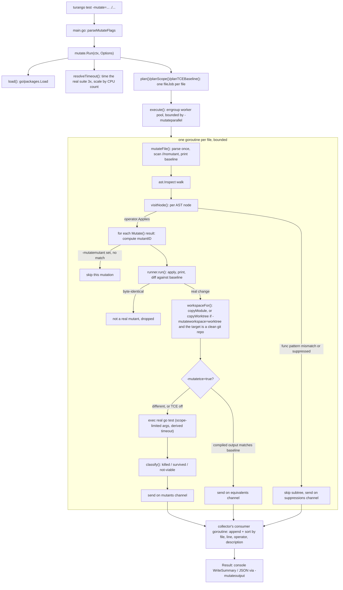

# turango


Mutation testing for `go test`, added the same way fuzzing was: not a
separate tool bolted onto the ecosystem, but a `go`-compatible drop-in that
adds one new test mode.

`turango` is a transparent shim binary. `turango test -mutate=. ./...` runs
the mutation engine; every other invocation (`turango build ./...`,
`turango vet ./...`, plain `turango test ./...`, ...) is forwarded verbatim
to the real Go toolchain, unchanged.

Mutation testing measures test-suite *quality*, not code coverage. It
mechanically introduces small, reversible changes ("mutants") into a
package's AST — flip `+` to `-`, flip `<` to `<=`, delete a statement, empty
an `if` body — and reruns the test suite against each one. A mutant the
suite catches is "killed": proof the suite actually asserts on that
behavior. A mutant that survives is a gap — code that runs during tests but
that nothing checks.

See [`PROPOSAL.md`](PROPOSAL.md) for the full case for why this belongs in
`go test` itself, including evidence gathered by running turango against
real `crypto/...` stdlib packages.

## Install / build

```
go build ./cmd/turango
```

That produces a `turango` binary you run instead of `go`. There's no alias
step required for normal use — see the note on alias mode below.

## Usage

```
turango test -mutate=. ./...
```

`-mutate` works like `-run`/`-bench`/`-fuzz`: its value is a regular
expression matched against function/method names, not a package selector.
`-mutate=.` matches every function (mirroring `-bench=.`'s "run every
benchmark" convention); package selection is the ordinary trailing
argument(s), exactly as with those three flags.

Everything that isn't `test` with a `-mutate=` flag goes straight to the
real `go` command:

```
turango build ./...     # identical to `go build ./...`
turango test ./...      # identical to `go test ./...` — no mutation, -mutate not set
```

### Flags (mutation mode only)

All of turango's own flags require the `-flag=value` form (a bare
`-flag value` is rejected as ambiguous). They're only recognized following
`test`.

| Flag | Default | Meaning |
| --- | --- | --- |
| `-mutate=<regexp>` | — | Required to enter mutation mode. A regular expression matched against function/method names in the target packages — behaves like `-run`/`-bench`/`-fuzz`, not a package selector. `-mutate=.` matches every function (mirroring `-bench=.`). Package selection is the ordinary trailing argument(s) after `test`, exactly as with those three flags, e.g. `turango test -mutate=. ./...`. |
| `-mutatescope=full\|package\|impact` | `full` | How much of the test suite reruns per mutant. `full` reruns `go test ./...` for the whole module (catches mutants killed by a neighboring package's tests); `package` reruns only the mutated file's own package (much cheaper, recommended when mutating a package that lives inside a slow module — see `example/README.md`); `impact` builds a per-test coverage map once and reruns only the tests that actually cover the mutated line. |
| `-mutateoperators=<comma-list>` | all registered operators | Restrict which mutation operators run (see the operator list below for names). |
| `-mutateparallel=<n>` | `GOMAXPROCS` | Worker-pool size. Parallelizes at the file level, since one file's AST is mutated in place across its own mutants. |
| `-mutatetimeout=<duration>` | baseline-derived | Per-mutant budget. If unset, turango times the real suite three times, averages, and scales by CPU count, so a mutant that produces an infinite loop (e.g. `i++` flipped to `i--`) doesn't stall the run to `go test`'s own ~10-minute default. A timeout counts as a kill. |
| `-mutateoutput=<dir>` | none | Write a JSON report (`mutate-report.json`) into this directory. |
| `-mutatemin=<float>` | none | Exit with status 3 if the resulting mutation score falls below this threshold (0–1) — for CI gating. |
| `-mutatemutant=<id>` | none | Replay exactly one mutant by the ID printed for it (in the console survivor listing or a JSON report's `MutantResult.ID`). The engine still walks every file and node — that part is cheap — but only the matching mutation is ever run, so the result holds at most one mutant. |
| `-mutatetce=true\|false` | `false` | Trivial Compiler Equivalence: filter a mutant whose compiled output exactly matches a per-package baseline before it ever reaches the test suite, reporting it separately (see below) instead of as an ordinary survivor. Off by default — see "Filtering equivalent mutants" below for why. |
| `-mutateworkspace=copy\|worktree` | `copy` | How each mutant's throwaway execution copy is built. `copy` recursively copies the module (works everywhere, no git dependency). `worktree` uses `git worktree add` instead, which shares the repository's object store rather than duplicating files — cheaper when the target module lives in a large git repo. Strictly opt-in and self-falling-back: requesting it against a target that isn't inside a clean git working tree (or isn't a git repo at all — every corpus fixture under `corpus/*/module/` is deliberately a plain directory) silently reverts to `copy`, never an error. |
| `-mutateestimate=true\|false` | `false` | Preview a run instead of executing it: walk every file/node to count how many mutants would be generated, per package, then time one baseline sample per package (whole-module under `-mutatescope=full`, per-package otherwise) to extrapolate a rough serial and `-mutateparallel`-divided time estimate — both explicitly hedged, since real speedup is sub-linear under contention. No mutation is ever applied to disk and no mutant's `go test` is ever spawned to classify it. Incompatible with `-mutateoutput`/`-mutatemin`, which are rejected at parse time (nothing was classified, so there's no report to write or score to gate on). |

### Filtering equivalent mutants: `-mutatetce`

Some mutations are real, syntactically-different edits that nonetheless
compile to *identical* code — a classic equivalent mutant (`i*1` vs `i`, or
deleting a dead store nothing downstream reads). A `Survived` verdict on one
of these is noise: the suite didn't miss a real behavioral gap, because
there was no behavioral difference to notice.

`-mutatetce=true` catches this class specifically: it builds each mutant's
package once, normally, then again with `go build -gcflags=-S` (an assembly
listing) and compares it — with source line-number annotations stripped —
against a once-per-package baseline built from the unmutated source. A match
means the mutant never reaches `go test` at all; it's reported under the
JSON report's `Equivalents` array (and a summary `equivalent: N` line) rather
than as a `MutantResult`.

Off by default. Unlike `-mutatescope`, where a conservative choice only
under-reports kills, a false positive here would silently discard a real
mutant — so this stays opt-in until it has more real-world runs behind it
(see `ROADMAP.md` gap 2 for the validated design and the spike that ruled
out the simpler raw-archive-comparison approach).

### Before/after source in the JSON report

Every `MutantResult` in `-mutateoutput`'s JSON report carries `Before`/
`After`: the mutated node's printed source text, immediately before and
after the mutation — the actual diff `Description` only summarises (e.g.
`Description: "== -> !="`, `Before: "v < lo"`, `After: "v >= lo"`), usable
without hand-deriving it from `File`/`Line` and a checkout of the source at
that point. `After` is empty for a removed statement (there's nothing there
to print) rather than a stale duplicate of `Before`. The console survivor
listing is unchanged — `Description` is still the only per-row text shown
there, to keep the table scannable.

### Reproducing one mutant: `MutantResult.ID`

Every mutant gets a stable ID: a SHA-256 hash of its file path (relative to
the module root), line, column, operator name, and its index within that
operator's offered mutations, truncated to 12 hex characters (the length of a
git short SHA). It's stable across re-runs of unchanged source — the whole
point — but *not* across edits to the file above the mutated line, since
what's hashed is a position in a specific AST, not self-contained bytes.

A CI failure or a `//nomutant`-adjacent comment can point at one exactly:

```
turango test -mutatemutant=a1b2c3d4e5f6 -mutate=. ./pkg/...
```

`-mutate` still needs a value (it's a required regexp, not optional);
`-mutatemutant` narrows further to one exact mutant once mutation mode is
already active.

### Building each mutant's workspace: `-mutateworkspace`

Every mutant runs against its own throwaway copy of the target module — the
mutated file has to sit somewhere that isn't the real source tree, and the
copy needs the whole module graph to resolve imports (sibling packages,
`replace` directives, `vendor/`, `//go:embed` assets). By default (`copy`)
that's a plain recursive filesystem copy. `-mutateworkspace=worktree` builds
it with `git worktree add` instead: a worktree shares the repository's
object store rather than duplicating files, so it's cheaper on a large git
repo, and a local `replace` directive pointing at a sibling checkout already
resolves correctly with no path rewriting needed, since a worktree is the
same repository checked out twice.

It's opt-in, not a smarter default, because it has a real precondition a
filesystem copy doesn't: `git worktree add` checks out `HEAD`, the last
*commit*, never the on-disk working copy. Requesting `worktree` against a
target with any uncommitted change anywhere in the repository (not just
under the mutated package) — or against a target that isn't a git
repository at all — falls back to `copy` on its own, silently and safely,
so it's never wrong to ask for it; it just doesn't always help.

### Suppressing a mutant: `//nomutant`

A `//nomutant` (or `//nomutant: reason`) comment above a statement excludes
it from mutation. On a compound statement (`if`/`for`/`switch`) the
suppression cascades into its body. See `example/README.md` for a worked
example, including how it affects the reported score.

### Exit codes

`0` success, `1` failure/error, `2` bad usage, `3` mutation score below
`-mutatemin`.

## Mutation operators

Thirteen operators, across six packages:

- **`control`** — `control/if`, `control/else`, `control/case`: remove a
  conditional body.
- **`expression`** — `expression/remove`: eliminate a `&&`/`||`
  short-circuit operand.
- **`statement`** — `statement/remover`: delete a statement.
- **`operator`** — `operator/assignment`, `operator/binary`,
  `operator/boundary` (`<`↔`<=`, `>`↔`>=` — the classic off-by-one mutant),
  `operator/inc_dec`, `operator/unary`: token-swap mutations.
- **`literal`** — `literal/number` (shifts an integer literal by ±1, or a
  float literal by a small relative nudge in each direction),
  `literal/boolean` (`true`↔`false`).
- **`identifier`** — `identifier/constswap`: swaps a package-level const
  reference for a same-type sibling in the same `const(...)` block — the
  only operator built on `go/types` rather than `go/ast` alone.

Known gap (documented in `PROPOSAL.md`): `identifier/constswap` only swaps
const-for-const, so it still can't reproduce a *local-variable*-to-constant
substitution — the exact shape of the historical strconv `ParseUint`
overflow bug (`#21278`). That extension is design-sketched in `ROADMAP.md`
but not built.

## Architecture

Mutant generation and collection, end to end. Results are collected into one
`*Result` by a single consumer goroutine draining three channels (mutants,
suppressions, TCE-filtered equivalents) — not a mutex — so the pipeline
stays `testing/synctest`-visible for future scheduling tests (see
`ROADMAP.md` gap 7); the worker pool itself is file-level (`errgroup`,
bounded by `-mutateparallel`), and each file's walk is strictly sequential
internally since a file's mutants share one AST that is mutated in place
and reverted between mutants.



## Try it

- [`example/`](example/) — ordinary, deliberately-imperfect order-pricing
  code with an ordinary test suite. `example/README.md` has a runnable
  command and real, unedited turango output, including what surviving
  mutants point to and what `//nomutant` costs the score.
- [`example/legacy/`](example/legacy/) — the original `go-turango`
  prototype's demo package, ported unchanged: one coarse assertion,
  38 mutants, 12 survivors — a clean illustration of what a single
  overall-result check misses.

## Alias mode (experimental, opt-in)

Renaming or symlinking `turango` to `go` and placing it ahead of the real
toolchain in `PATH` routes *every* tool on the machine that shells out to
`go` (editors, `gopls`, CI, `go generate`, ...) through turango's
passthrough. That's a large blast radius for one unhandled verb or flag, so
it's gated behind `TURANGO_EXPERIMENTAL_ALIAS=1` and not advertised as a
default way to use turango. Use `turango test -mutate=. ./...` directly
instead.

## More

- [`PROPOSAL.md`](PROPOSAL.md) — the case for adding `-mutate` to `go test`
  itself, modeled on the real `-fuzz` design draft, with crypto-package
  evidence and a historical-bug validation case study.
- [`PROGRESS.md`](PROGRESS.md) — build and development history for this
  project.

## License

MIT — see [`LICENSE`](LICENSE).
